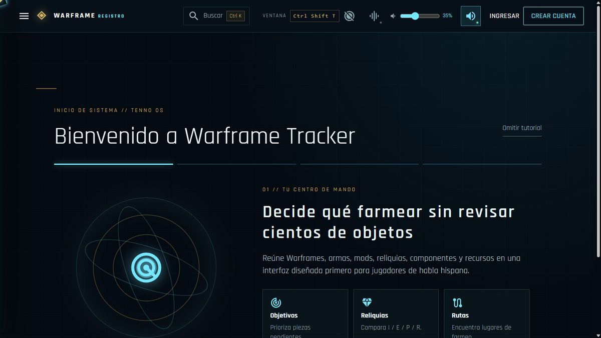
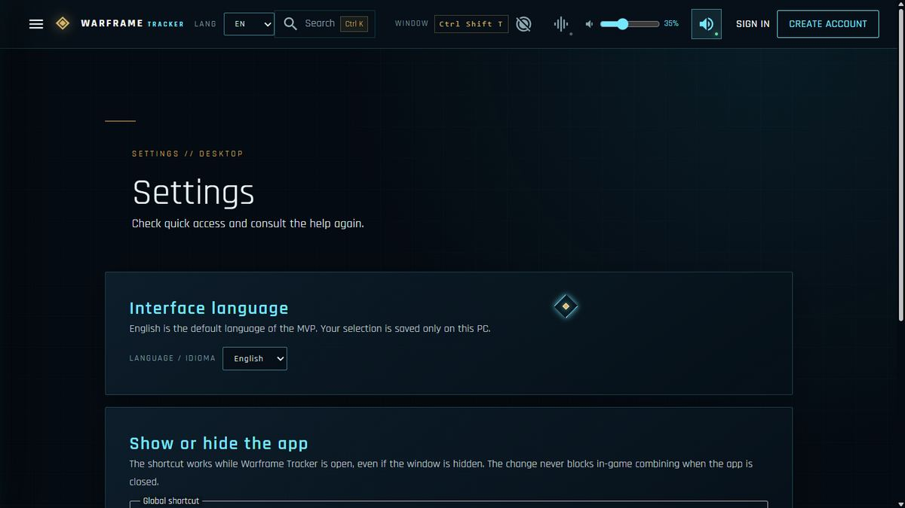
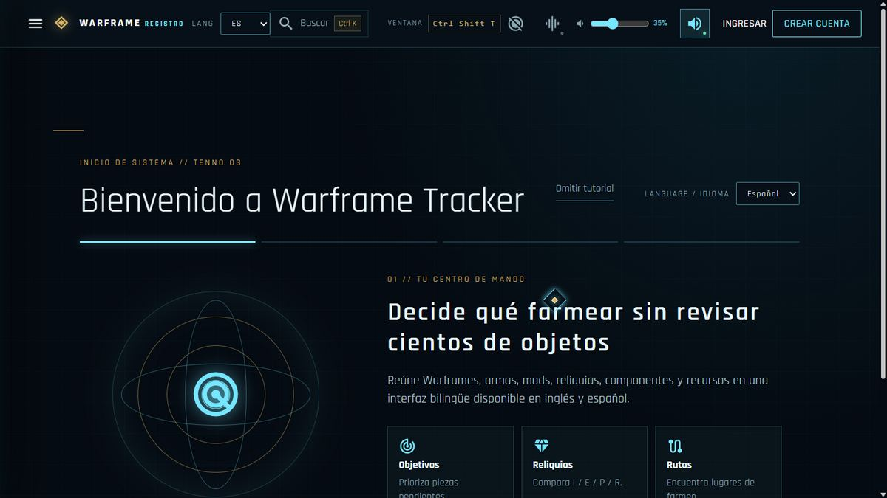
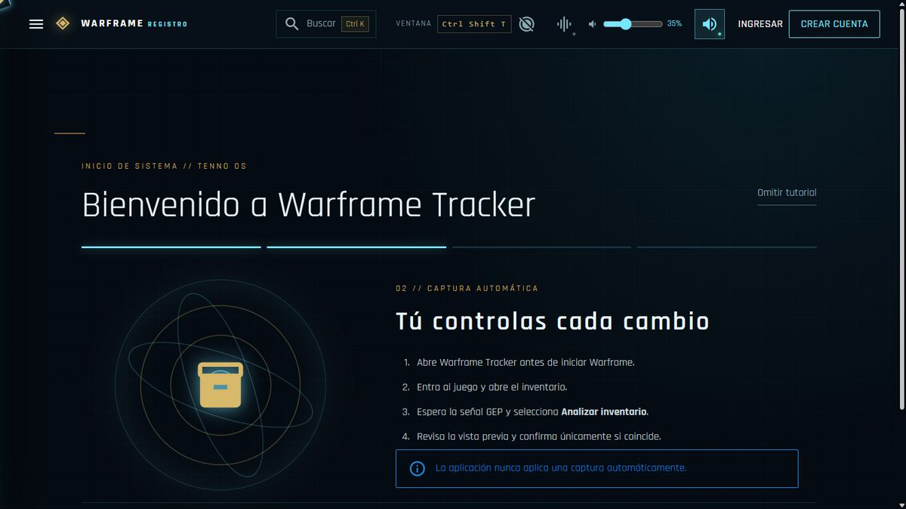
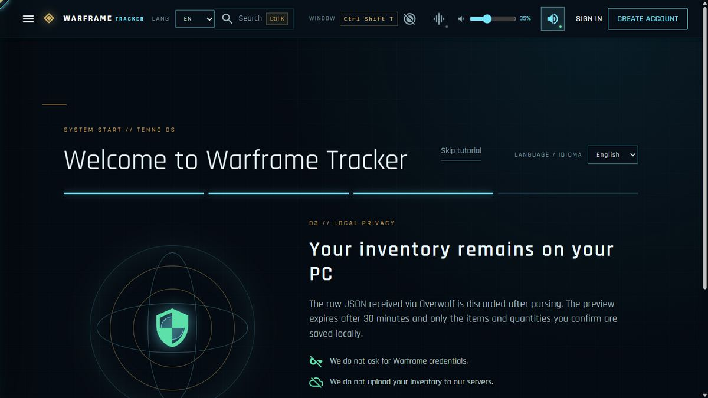
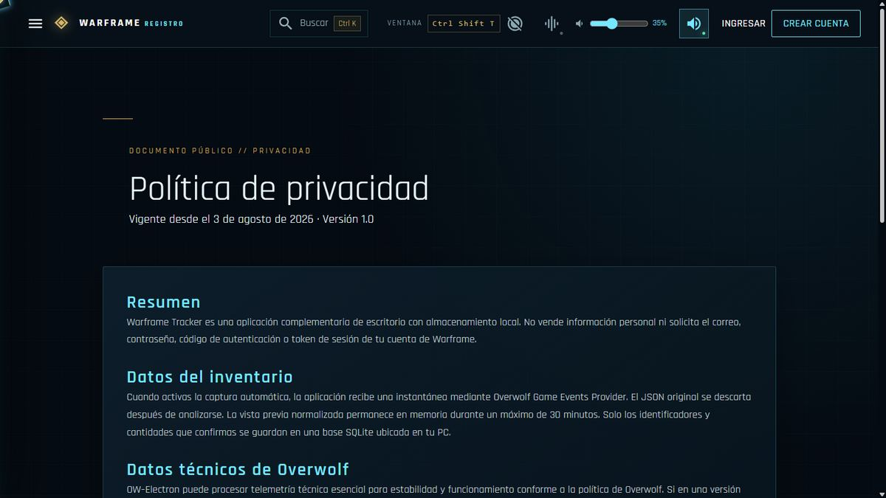
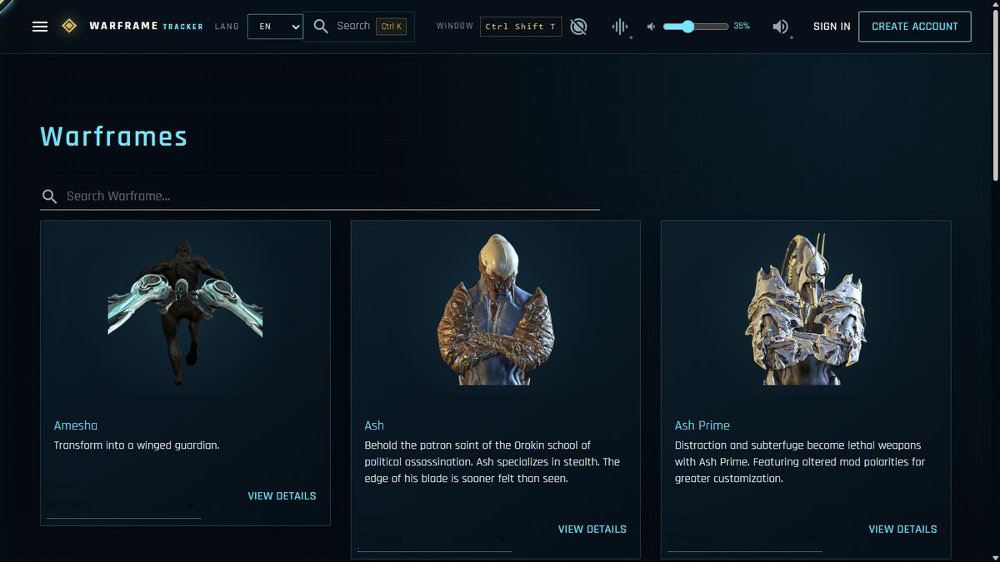
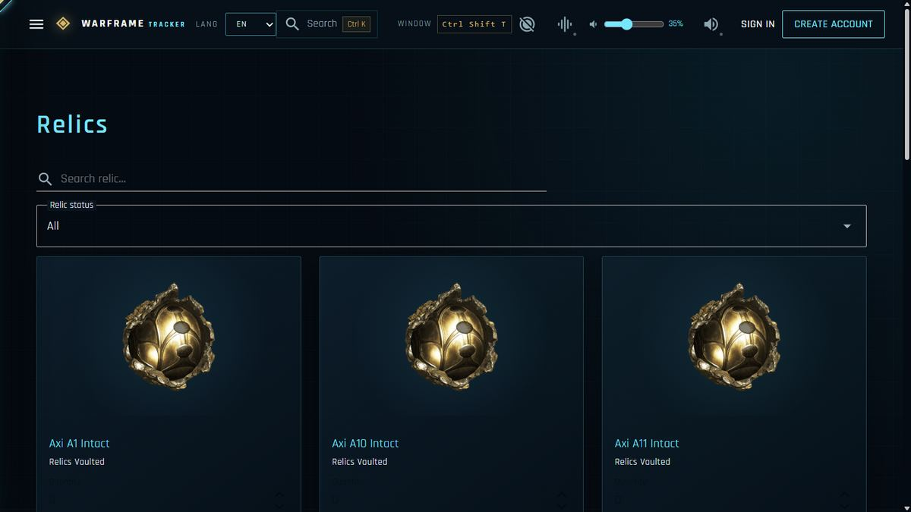
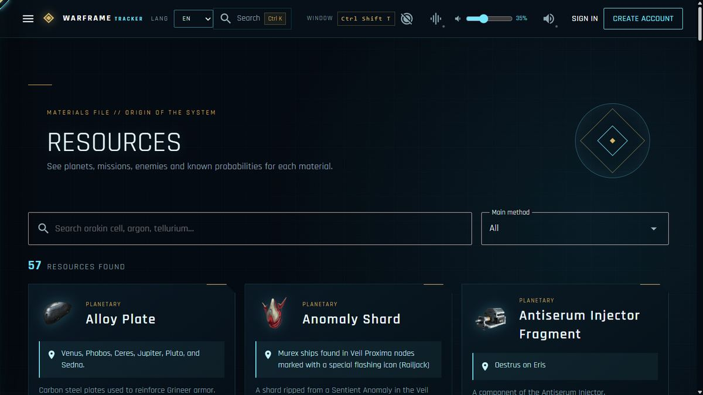

# Warframe Tracker — guía de evaluación del MVP

Versión evaluada: **0.1.0**  
Plataforma: **OW‑Electron para Windows 11 x64**  
Juego: **Warframe, game ID 8954**  
Idioma predeterminado: **inglés**. Idioma adicional: **español**, seleccionable y persistente.

## 1. Propósito

Warframe Tracker es un asistente público de inventario y planificación para
Warframe. Su objetivo es que los jugadores, especialmente los hispanohablantes,
puedan revisar su colección, descubrir qué piezas les faltan y elegir rutas de
farmeo sin registrar manualmente cientos de objetos.

La aplicación tiene una ventana de escritorio visible durante toda la sesión.
No es un proceso oculto ni un puente destinado a alimentar servicios externos.

## 2. Instalación y primera apertura

1. Ejecutar `Warframe-Tracker-Setup-0.1.0.exe` en Windows 11 x64.
2. Completar la instalación y abrir Warframe Tracker desde el acceso directo.
3. Recorrer el tutorial inicial con **Siguiente**. Puede omitirse y volver a
   abrirse desde **Navegación > Tutorial**.
4. Crear un perfil local. Este perfil no es una cuenta de Warframe y no debe
   utilizar la misma contraseña.
5. Warframe Tracker almacena los perfiles y el inventario confirmado en SQLite
   dentro de la carpeta local de la aplicación.

El primer inicio siempre utiliza inglés en una instalación limpia. El selector
`EN / ES` está disponible en la barra superior, en el tutorial y en Ajustes. La
preferencia se guarda únicamente en el PC y puede cambiarse sin reinstalar.

## 3. Captura automática y consentimiento

1. Abrir Warframe Tracker antes de iniciar Warframe.
2. Iniciar Warframe en PC y esperar a que GEP detecte el juego.
3. El inventario se recibe durante el inicio de sesión o una pantalla de carga.
   Si no aparece, viajar a un Repetidor, Dojo o misión y regresar.
4. Volver a Warframe Tracker y entrar en **Inventario automático**.
5. Pulsar **Buscar captura**.
6. Cuando aparezca **CAPTURA RECIBIDA**, seleccionar **Analizar inventario**.
7. Revisar Warframes, armas, mods, reliquias, componentes y recursos detectados.
8. Verificar la columna **Actual** frente a **Capturado**.
9. Seleccionar **Aplicar cambios** solamente si la vista previa coincide.

La aplicación nunca aplica datos automáticamente. Una captura parcial añade o
actualiza los objetos encontrados, pero no pone en cero los elementos ausentes.

> **Validación real completada:** GEP 400.22.0 recibió 2.406 tipos distintos en
> una captura autoritativa. Se verificó además la conservación independiente de
> Intacta, Excepcional, Perfecta y Radiante. Los informes no contienen el JSON
> bruto, el nombre del jugador ni cantidades detalladas.

## 4. Privacidad y seguridad

- No se solicitan credenciales, códigos 2FA ni tokens de Warframe.
- El backend escucha únicamente en `127.0.0.1` y utiliza un puerto aleatorio.
- Cada ejecución genera una clave de puente efímera de 256 bits.
- El JSON bruto se descarta después del análisis.
- La vista previa expira como máximo después de 30 minutos.
- Solo se persisten localmente los cambios confirmados.
- El renderer no dispone de integración Node; utiliza aislamiento de contexto y
  sandbox de Chromium.

La política completa se encuentra en `/privacy` y el soporte en `/support`.

## 5. Funciones principales que debe revisar QA

### Catálogo e inventario

- Warframes y componentes.
- Armas primarias, secundarias, cuerpo a cuerpo y equipamiento adicional.
- Mods, cantidades duplicadas y fuentes de obtención.
- Reliquias unificadas por nombre y cantidades Intacta, Excepcional, Perfecta y
  Radiante.
- Componentes Prime y recursos.

### Planificación

- Centro de mando con progreso de colección.
- Objetivos personales.
- Elementos que pueden construirse y sets casi completos.
- Planificador de farmeo.
- Laboratorio de refinamiento y probabilidades de reliquias.
- Comparador con búsqueda escrita.
- Worldstate y oportunidades activas.

### Controles generales

- Menú lateral y buscador universal con `Ctrl+K`.
- Música y volumen ajustables.
- Sonidos de interfaz opcionales.
- Movimiento reducido.
- Tutorial revisitable, privacidad y soporte.
- Atajo global configurable para mostrar u ocultar la ventana; el valor actual
  también aparece en la barra superior.

## 6. Eliminación y soporte

Para borrar todos los datos locales:

1. Cerrar Warframe Tracker.
2. Desinstalar la aplicación.
3. Eliminar `%APPDATA%\warframe-tracker-desktop`.

No adjuntar a una incidencia contraseñas, claves, tokens ni el JSON bruto del
inventario. El canal público de soporte es:

`https://github.com/infacundo2/Warframe-Tracker-v2/issues`

## 7. Limitaciones conocidas de esta candidata

- La build distribuible aún necesita la firma de Overwolf y la firma de código
  del ejecutable para que GEP cargue fuera del modo de desarrollo.
- La firma de producción requiere el App UID, `OW_CLI_API_KEY` y `OW_BUILD_KEY`
  disponibles después de registrar la app, además de un certificado de firma
  de código emitido por una autoridad confiable.
- Las imágenes finales de captura real reemplazarán dos imágenes de tutorial
  antes del envío.
